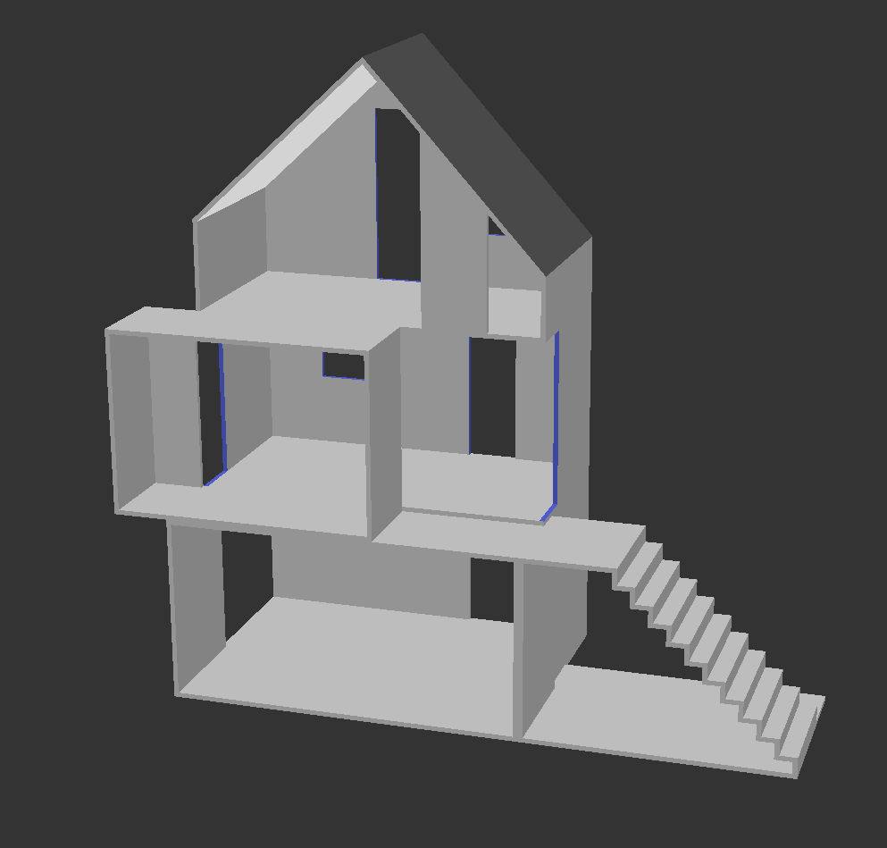
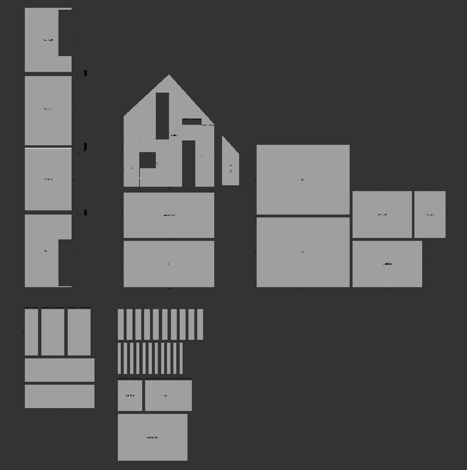
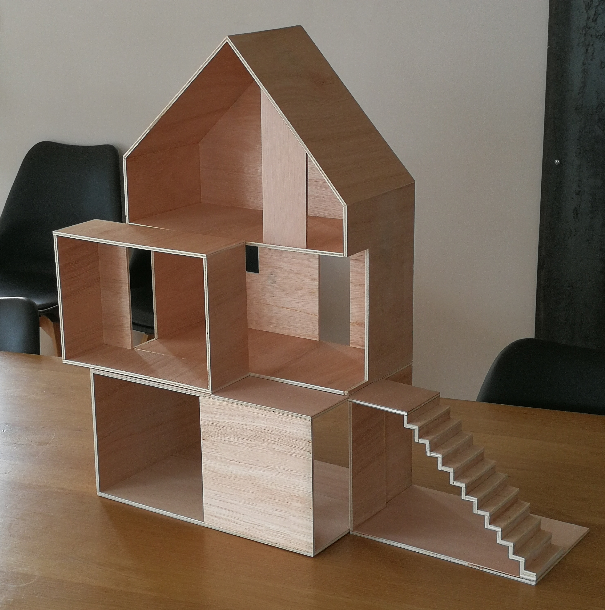

# The Polish Doll House

This OpenSCAD project aims to create a doll house inspired by the products of the now-defunct Polish company: [Boomini](https://boomini.com/mini-wood/). This house's design is so smart and so beautiful I couldn't resist to build it myself for my children.

<table>
    <tr>
        <td></td>
        <td></td>
    </tr>
</table>

OpenSCAD allowed me to change parameters (dimensions, material thickness) without re designing it from scratch, and I get inspired by [Scott Bezek's article](https://scottbezek.blogspot.com/2016/05/openscad-rendering-tricks-part-2-laser.html) to handle a 3D/2D switch that lets me export blueprints with (almost) all dimensions necessary to do the cuts.

## Installation

Minimum OpenSCAD version: 2025.11.09

You must install the following libraries by following their installation instructions in their corresponding README files:
- The house's roof and stairs rely on the [openscad-doll-house](https://codeberg.org/adrien-delhorme/openscad-doll-house) library,
- and all dimensions are handled by the [openscad-new-dimensions](https://codeberg.org/adrien-delhorme/openscad-new-dimensions) library.

## Customization

The size of the house and the material thickness can be customised through OpenSCAD UI Customizer. Additional parameters may be changed within the source code. See [`doll-house.scad`](doll-house.scad) file.

<video width="100%" controls autoplay loop src="/adrien-delhorme/polish-doll-house/raw/branch/main/assets/demo.webm">
  <strong>Votre navigateur ne supporte pas la balise «&nbsp;vidéo&nbsp;» HTML5.</strong>
</video>

## Exporting blueprints

You can easily switch between 3D render mode and Flat render mode to visualise each piece separately. All dimensions and cutting angles can be displayed on both render modes.

Some shapes are formed by subtracting a piece by another. It is easy to model, but very tedious to process dimensions. So we have to rely on another 2D CAD software to draw these dimensions on our blueprint.

LibreCAD is an interesting solution to do this job:
1. Render the scene with 2D mode
2. export as SVG,
3. import into LibreCAD and draw all dimensions you need,
4. print,
5. warm up your circular saw!
